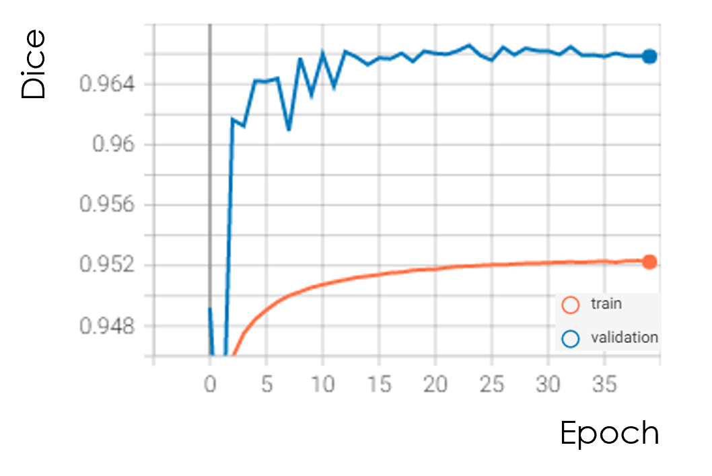
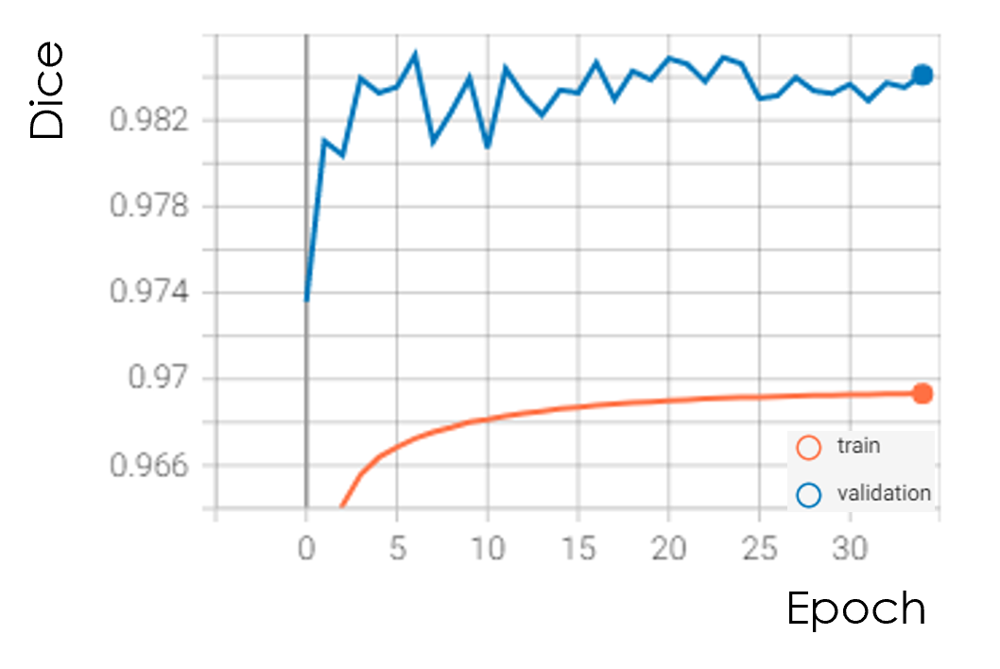
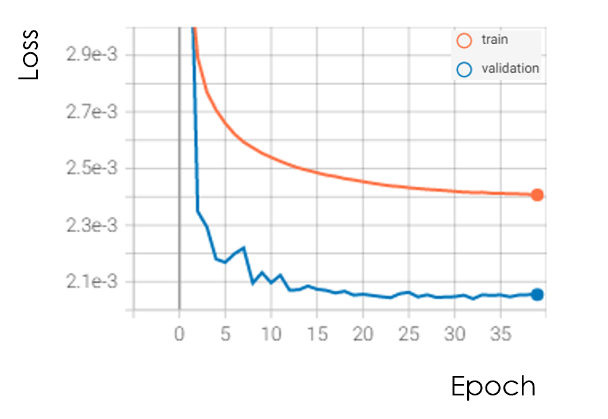
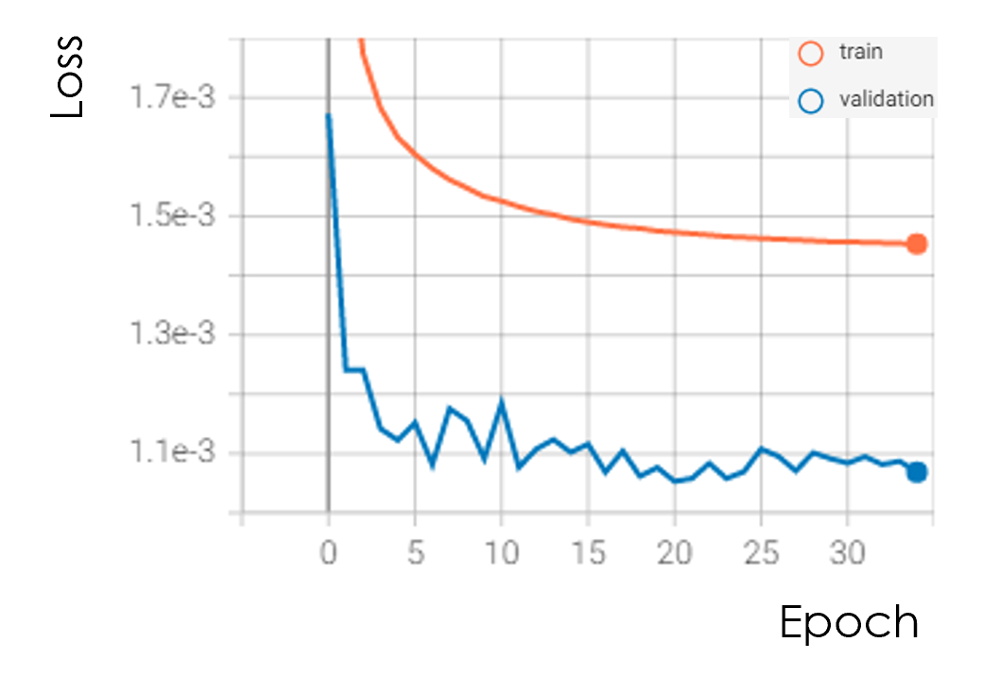
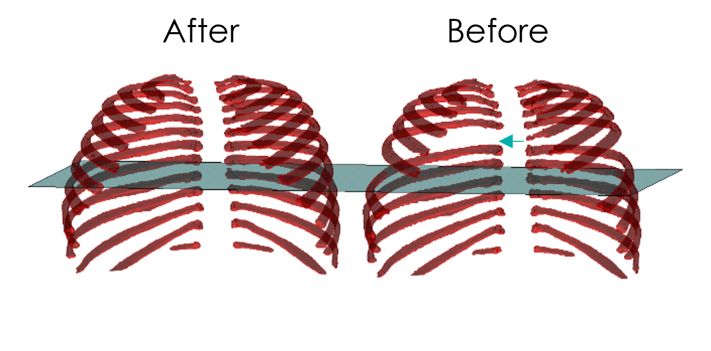

# Rib Segmentation (2D and 2.5D)
This project implements rib segmentation using deep learning techniques with 2D and 2.5D inputs. The goal was to improve segmentation quality, particularly in cases involving anatomical variations such as lumbar ribs.

It includes:
- Segmentation models trained on chest CT slices
- Evaluation and inference pipelines for both 2D and 2.5D settings
- Experimentation with different regularization and loss strategies
- Visualization tools for assessing performance
- Analysis of segmentation quality using Dice score and loss metrics

## Author
Serge Alhalbi

## Company
Riverain Technologies

## Collaborators
- Jason Knapp  
- Xiaotian (Dennis) Wu

## Tools and Libraries
- Python

## Usage
```bash
git clone https://github.com/SergeAlhalbi/rib-segmentation.git
cd rib-segmentation
```

## Results
Below are selected results comparing 2D and 2.5D segmentation performance:

### Dice Scores
- **2D Dice Score**:  
  

- **2.5D Dice Score**:  
  

### Loss Curves
- **2D Loss**:  
  

- **2.5D Loss**:  
  
### Visual Result
- **Predicted vs Ground Truth Rib Mask**:  
  
